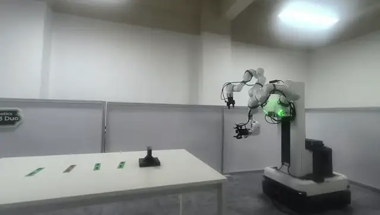

# TMR Franka Task 2 — Red Strip Detection

Detect red strip-shaped labels on a tabletop from live JPEG images captured by the mobile manipulator's main ZED-M camera.

The production entry point first opens the left gripper, sets the Spine to `0.600 m`, restores the right arm to its recorded raised and retracted parking pose, then resets the left arm and verifies the error state of both arms. Initialization does not command the right gripper; startup aborts if any step fails.

## Demo

[](docs/assets/task2-demo.mp4)

Click the accelerated preview above to open the complete 5-minute 14-second,
silent demonstration, or use the direct
[full demo video](docs/assets/task2-demo.mp4) link.

## Installation

```bash
python3 -m venv .venv
. .venv/bin/activate
pip install -r requirements.txt
```

NumPy and OpenCV are normally already installed on the robot host, so `/usr/bin/python3` can also be used directly.

For a pinned, operator-ready ROS 2 Docker image and the exact build, preflight,
health-check, and launch commands, see [Docker deployment](DOCKER.md).

## Repository layout

```text
policy/                 Python policy and runtime entry points
  config/               Robot poses, calibration, and workflow records
  captures/             Calibration and detector reference images
  red_strip_detector/   Red-strip detection package
docker/                 Container entrypoint
tests/                  Repository-level automated tests
Dockerfile              Reproducible ROS 2 policy image
DOCKER.md               Pinned operator build and launch procedure
```

All Python policy commands below are run from the checkout's `policy/`
directory. Paths such as `config/...`, `captures/...`, and `outputs/...` are
relative to that directory. Run the test suite from the repository root.
The bare Python examples are for a native shell in which ROS 2 and the Franka
interfaces have already been sourced. Evaluators should use the self-contained
Docker workflow below; it supplies those interfaces without any host setup
file.

## Docker quick start

Run the Docker workflow on robot host `.100` as user `aup`. Use the complete,
copy-ready commands in [Docker deployment](DOCKER.md#operator-commands); that
document starts from the submitted pinned commit and requires no host project,
setup file, private-key directory, or screen session. It forwards the testbed's
existing SSH-agent login to stage the bundled base worker on `.50`.

1. Run the operator checkout and `docker build` block.
2. Run `preflight` to validate the image and bundled ROS environment without
   contacting the robot graph or sending motion.
3. Run `check` for read-only ROS graph and camera health checks.
4. Only after confirming the initial pose, gripper state, clear workspace, and
   reachable emergency stop, run `execute` to allow physical motion.

The image defaults to `check` when no mode is supplied. Its entrypoint is
`/usr/bin/tini -- /opt/tmr-task2/docker/entrypoint.sh`, and the entrypoint runs
the policy from `/opt/tmr-task2/policy`. The image builds the pinned Franka and
Spine ROS interfaces and includes its CycloneDDS configuration and camera
bridge. It does not mount or require `/home/aup/tmr_env.sh`,
`/home/aup/tmr-mobile-manipulation`, `/home/aup/.ssh`, or `/run/screen`.
Writable configuration, outputs, and runtime records use Docker volumes. The
base worker and velocity adapter are transferred from the image to an isolated
temporary directory on `.50`, where they run in the native Humble Domain 97.

## One-line command

```bash
cd tmr_franka_task2_grasp/policy && /usr/bin/python3 start_project.py --annotated-output outputs/red_strip.jpg
```

The initialization target is stored in `config/initial_pose.json`. After every successful startup, the measured state is written to and overwrites the repository-tracked file `config/latest_initial_state.json`. Production runs must use `start_project.py`; `detect_red_strip.py` is retained only for offline debugging without robot control. After a new initial state or project code update has been verified, the changes should be committed and pushed to the remote repository.

The default input is:

```text
http://172.16.0.50:18082/tmr_zed_latest.jpg
```

The output JSON contains the target center in pixel and normalized coordinates, the four corner coordinates, major-axis direction, pixel length and width, area, and confidence. Exit code `0` means detection succeeded, `2` means no target was found, and `3` means the camera image did not update.

For an offline image:

```bash
/usr/bin/python3 detect_red_strip.py --image frame.jpg --all --annotated-output outputs/result.jpg
```

The tabletop region can be adjusted for the on-site camera view:

```bash
/usr/bin/python3 detect_red_strip.py --roi-top 0.40 --roi-bottom 0.95
```

## Testing

```bash
python3 -m pip install pytest
python3 -m pytest -q
```

Detection uses two HSV red ranges, morphological denoising, and rotated-rectangle geometry constraints. It handles red hues on both sides of the HSV 0/179 boundary. HTTP input checks `Last-Modified` so that a repeatedly downloaded stale JPEG is not treated as a new frame.

## Lateral alignment of the black base and gray thermal pad

Observe and report a decision only:

```bash
/usr/bin/python3 align_to_thermal_pad.py
```

Allow actual lateral motion:

```bash
/usr/bin/python3 align_to_thermal_pad.py --execute
```

The program prioritizes closed-loop centering with the left wrist camera. On-site calibration at the initial pose maps the top and bottom of the wrist image to the robot's left and right, respectively. The base therefore moves left when the target is above the image center and right when it is below. If the wrist camera cannot see the target, the target's horizontal position in the main camera provides the search direction. Each lateral step is limited to `0.02 m` by default. As required for the current Task 2 setup, the dual-LiDAR collision gate is disabled; motion constraints use only fresh odometry, a stationary-state check, the control lease, command subscribers, and timeouts. Zero velocity is still sent repeatedly whenever the program exits.

Base motion is coordinated from the host-network container, but its bundled worker runs on `.50` inside the native Humble Domain 97. The image stages that worker through the testbed's existing non-interactive connection; it does not invoke a remote repository script, and no base command is sent to either arm.

## Thermal-pad terminal-grasp FK/IK

Run the following sequence in a fixed order: reset the left arm to its initial pose → visually center the base → continuously confirm that the base is stationary → register raw D405 depth → apply the hand-eye transform → solve FK/IK.

```bash
cd tmr_franka_task2_grasp/policy && /usr/bin/python3 run_thermal_pad_pipeline.py --execute
```

The final stage only solves and validates the motion. It does not close the gripper or execute a grasp trajectory. Results are written to `config/latest_thermal_pad_ik.json`, and the annotated image is written to `outputs/thermal_pad_ik.jpg`. `kinematics.avoid_collisions` in `config/thermal_pad_pick.json` is currently fixed to `false`, so the MoveIt planning-scene collision gate is not invoked.

`thermal_pad_ik.py` simultaneously requires all of the following: the thermal-pad center must be within ±35 px along the Y axis of the left wrist image; base velocity must remain below the threshold for one continuous second; the left arm must be at the recorded initial joint pose; the RGB/depth timestamp difference must not exceed 0.1 seconds; at least five of seven depth frames must agree in 3D; hand-eye calibration must agree with FK; and all IK points must be continuous with bounded joint steps. If any condition is not satisfied, the program exits without motion. At the current initial pose, the end of the pad that is closer to the robot and hangs downward is calibrated as the image `+X` end of the thermal pad's major axis. Parameters are centralized in `config/thermal_pad_pick.json`.

Before resetting the arm, the entry point runs `bootstrap_left_runtime.py` with `--state-only`. This verifies that the left-arm hardware, error recovery, and both state broadcasters are available, after which a native low-speed PTP motion performs the reset. The production entry point does not enable the impedance controller, preventing the controller from reading an empty or stale target after an FCI reconnection.

FK/IK requests read the measured Spine height, currently `0.600 m`, and explicitly compose the coordinate chain from the whole-robot base through the left-arm mount to the measured FCI end effector. The FCI pose in the left arm's local frame must never be compared directly with the MoveIt whole-robot frame. The measured flange offset from `link8` to the end effector is stored in `config/thermal_pad_pick.json`.

### Thermal-pad grasp, lift, and disengagement motion design

The FK/IK planner also generates a complete motion sequence whose execution on the physical robot is disabled by default. At the detected grasp-endpoint height, the gripper's extension/fingertip axis is aligned with ground-frame `+X`, while the finger opening/closing axis is aligned with ground-frame `+Z`. The gripper is therefore horizontal, with one finger above the other. After opening, the gripper advances along `+X` to the target and closes. It then lifts `0.12 m` along `+Z` and moves `0.12 m` toward the far side along `+X`; the first segment ends and holds at this pose. After separate authorization, the second segment first descends `0.22 m` along `-Z`, then moves diagonally down and inward along `-Z/-X` while maintaining the same horizontal orientation. Only after the diagonal motion has fully completed does the gripper open. The fingertip axis then rotates by a small angle from `+X` toward ground-frame `-Z` while continuing to retract along `-X`, producing an inverted-scoop disengagement motion. Orientation and position use synchronized interpolation; every intermediate point requests IK and is checked for a valid state.

Coordinates and parameters are defined under `motion_sequence` in `config/thermal_pad_pick.json`. All directions and heights are expressed first in the whole-robot `base` frame, which is parallel to the ground. The shoulder-local end-effector pose returned by FCI must be transformed through whole-robot root → Spine → left-arm mount before these displacements are applied. These offsets must never be added directly in the shoulder frame `left_fr3v2_link0`. Here, “the same height as the previous grasp endpoint” uses the transformed ground-reference Z coordinate. The first segment's `0.12 m` lift and `0.12 m` far-side move, and the second segment's `0.22 m` descent, are relative displacements along ground-frame axes and therefore do not depend on the exact location of the ground-frame origin.

The user-specified `0.12/0.12 m` lift/far-side transfer in the first segment and the `0.22 m` descent in the second segment are fixed. The open-loop forward distance, diagonal descent/retraction distance, and inverted-scoop angle still lack on-site dimensional evidence; they are conservative initial design values and are marked `parameters_calibrated: false`. The current provisional inverted-scoop angle is `15°`: it changes the gripper orientation by pitching it downward from horizontal, rather than applying a positional correction along `+X`. Until TCP calibration, the tabletop PlanningScene, grasp visual verification, and small-step on-site calibration have all been completed, every actuator must refuse to execute this placement/disengagement sequence.

The complete motion is split at the end of step 6 into two independently authorized segments. The first segment, `pick_lift_and_far_transfer`, performs the grasp, lifts `0.12 m`, and moves `0.12 m` toward the far side, then exits while holding the `carry_far_12cm` pose. The second segment, `lower_place_and_release`, may begin with the `0.22 m` descent only after the first segment's endpoint has been reconfirmed, the object is verified to remain securely grasped, and separate authorization has been granted. The second segment must never start automatically after the first segment completes.

## 2 m base approach and complete thermal-pad workflow

### Quick start when physical-robot services are healthy

Use the unified entry point from robot host `.100`. By default, it only prepares the runtime environment and does not move the base, either arm, or either gripper:

```bash
cd tmr_franka_task2_grasp/policy && /usr/bin/python3 -u quick_start.py
```

Run read-only checks only:

```bash
/usr/bin/python3 -u quick_start.py --check-only
```

After confirming that the robot is at the task's specified starting pose, the grippers are in the correct state, the work area is clear, and the emergency stop is within reach, launch the full workflow with one command:

```bash
cd tmr_franka_task2_grasp/policy && /usr/bin/python3 -u quick_start.py --execute
```

The quick-start entry point and every other motion entry point share the same single-instance lock. It first checks the core Jazzy ROS services, then restores the left arm's state-only runtime and checks the staged base-local Humble runtime in parallel, and finally requires the frame sequence numbers from the main camera and left wrist camera to continue increasing. Healthy services are reused rather than restarted; the container starts its own camera bridge, which subscribes to the wrist cameras in Jazzy and obtains the base-local ZED frame from `172.16.0.50:18082`. Bounded left-arm recovery runs only if the hardware is not `active` or the state stream is abnormal, in the fixed order: stop active controllers → ErrorRecovery → activate hardware → activate state broadcasters. If core drivers such as FR3, Robotiq, Spine, D405, base odometry, or IK are missing, the entry point does not guess or start a second instance. Instead, it fails before mission motion and reports the missing service, action, topic, or stale camera stream.

With `--execute`, the quick-start entry point passes a newly generated preparation record—valid for only 20 seconds and explicitly marked “no motion sent”—to the full workflow, avoiding duplicate initialization. Every base step still rechecks fresh odometry, stationary state, the control lease, the velocity-command subscriber, and its timeout. The staged base worker and zero-latching adapter run on `.50` in its isolated Humble graph; the arm-side policy client runs in the Jazzy container on `.100`, and the FCI real-time loops remain in the deployed robot drivers.

The complete workflow entry point is:

```bash
cd tmr_franka_task2_grasp/policy && /usr/bin/python3 -u run_full_thermal_pad_cycle.py --execute
```

If the base is already at the black-base grasp reference point and the left arm is already at the calibrated pre-grasp pose, service startup, the initial 2 m transport, the coarse black-base search, table-edge calibration, and motion into the pre-grasp pose can be skipped. Run the workflow from pre-grasp through post-release reset with one command:

```bash
cd tmr_franka_task2_grasp/policy && /usr/bin/python3 -u run_from_pregrasp_to_finish.py --execute
```

This entry point does not automatically start or restart any robot service. It first performs read-only checks of the core ROS services and all three live camera feeds, restores the Spine to `0.6 m`, restores the right arm to the recorded raised and retracted parking pose, and then checks the left-arm pre-grasp pose against measured joints and FK. Next, `black_base_pose_alignment.py` performs multi-scale consistency matching against three mutually overlapping black-base structural templates in the left wrist image. Scale corrects the base's forward/backward position, while the image Y residual corrects its lateral position. The gray thermal pad, which is viewed almost edge-on and appears only as a thin edge, is not used in template matching. Force-feedback approach, retraction, and gripper closure are allowed only after calibration passes.

The pre-grasp approach uses `2 mm` steps over a maximum distance of `16.2 cm`. It stops and retracts `18 mm` only if either Franka's native contact flag is set or a force increase of at least `2.5 N` along the approach axis persists for five consecutive frames. Cartesian torque and joint torque are diagnostic only and must never independently trigger gripper closure. Before closing the gripper, the workflow also verifies that calibration was valid when this approach began, the base was not commanded during the approach, and the current joints remain at the recorded retracted pose. It then lifts vertically by `12 cm`; detects the red pad with the main camera and performs lateral translation using total-odometry closed-loop control plus an end-effector residual correction; extends by `14.3 cm` and descends by `12 cm`; performs the backward-tilt release; disengages vertically; and restores the left arm to its initial pose.

If the robot is currently at the checkpoint “clockwise motion complete, awaiting counterclockwise recovery,” run all remaining stages beginning with counterclockwise recovery using one command:

```bash
cd tmr_franka_task2_grasp/policy && /usr/bin/python3 -u run_from_ccw_restore_to_finish.py --execute
```

This entry point first restores the Spine to `0.6 m` and the right arm to its parking pose, then verifies the left-arm pre-grasp pose. It subsequently performs a counterclockwise `90°` rotation, moves backward `55 cm`, moves right `1.40 m`, continues searching to the right for the black base by up to an additional `1.50 m`, restores the calibrated rear-wall angle and distance, rechecks the pre-grasp pose, runs the multi-scale black-base calibration described above, and continues through grasping, red-pad localization, placement, and left-arm reset. Runtime logs are written to `config/latest_ccw_restore_to_finish.json` and `config/latest_ccw_route_grasp_finish.json`.

The standard Task 2 initial position is defined by the left arm's reset pose. When starting from this standard initial position, use the primary entry point below. After the health check, it first resets the left arm, immediately moves the left arm to the pre-grasp pose, verifies the pose using joint data and FK, and then continues with the grasp, transport, placement, and final reset workflow described above:

```bash
cd tmr_franka_task2_grasp/policy && /usr/bin/python3 -u run_task2_from_initial.py --execute
```

This entry point likewise does not start robot services or perform the initial 2 m base transport, coarse black-base search, or table-edge calibration. The base must already be at the black-base grasp reference position. It still enforces multi-scale black-base calibration and the second gate immediately before gripper closure. Without `--execute`, it only prints the motion sequence.

The complete entry point first restores the Spine to `0.6 m`, restores the right arm to its parking pose, then restores the left arm to its transport-safe initial pose. It stages and checks the bundled Task 2 worker and velocity adapter on the base host instead of depending on `tmr-mobile-manipulation` or another remote repository. The base moves right by `2.0 m` in one continuous odometry closed-loop trajectory without intermediate segmented stops. It then performs the coarse black-base search, enters the pre-grasp pose, runs fine multi-scale calibration, performs the strict force-feedback approach, and continues with transport and placement. It does not read or overwrite any Task 3 files.

Final release is performed by `stage5_release_diagonal.py`. It first descends by `1.5 cm`, then continues descending and gradually pitches downward by `20°` while retracting `10 cm` along an ease-out curve that starts fast and finishes slowly. It subsequently applies the calibrated `1.2 cm` leftward end-effector correction, an additional downward pitch, and inward follow-through. The gripper remains closed until the final vertical disengagement begins; only then does it open, rise by `5 cm`, and restore the left arm to its initial pose. The workflow record is written to `config/latest_full_thermal_pad_cycle.json`. Without `--execute`, the program only prints the plan and sends no motion command.
